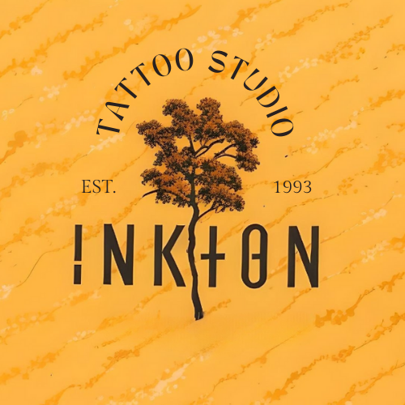
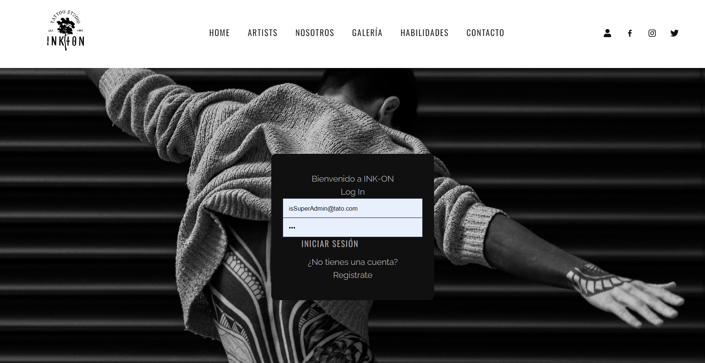
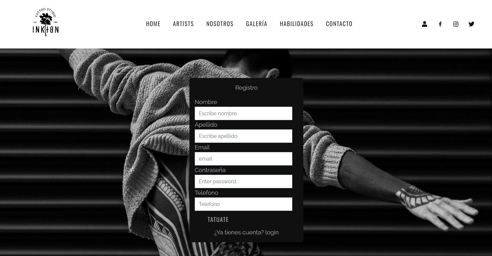
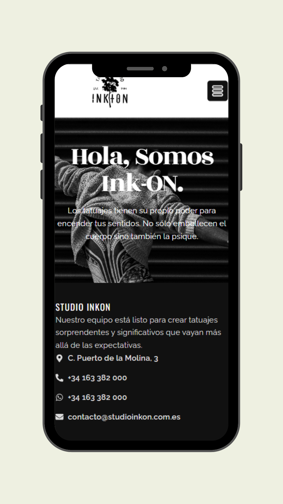
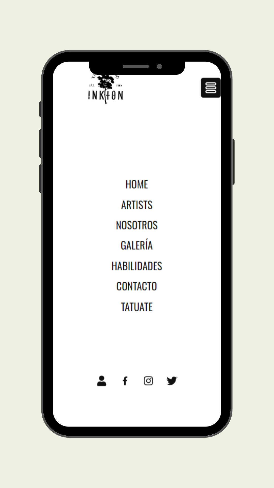

<h1 align="center">⚜️FRONTEND - Tattoo Studio INKON⚜️</h1>

<div style="text-align: center;"></div>

<details>
  <summary>Contenido 📝</summary>
<ol>
  <li><a href="#Objetivo">Objectivo</a></li>
  <li><a href="#Tecnologías utilizadas">Tecnologías utilizadas</a></li>
  <li><a href="#Imagenes">Imagenes</a></li> 
  <li><a href="#Instrucciones de Instalación">Instrucciones de Instalación</a></li>
  <li><a href="#Funcionalidades futuras">Funcionalidades futuras</a></li>
  <li><a href="#Agradecimientos">Agradecimientos</a></li>
  <li><a href="#Contacto ">Contacto </a></li>
</ol>
</details>

## Objetivo

- El objetivo de este esfuerzo es crear una aplicación frontend pulida y profesional que interactúe con nuestra API, diseñada para supervisar los aspectos operativos del modelo de negocio de un estudio de tatuajes. Esta aplicación tiene como objetivo ofrecer una amplia gama de vistas y funcionalidades adaptadas tanto a usuarios como a tatuadores y administradores.

## Tecnologías utilizadas

<p align="left"> <a href="https://www.w3schools.com/css/" target="_blank" rel="noreferrer">  </a> <a href="https://git-scm.com/" target="_blank" rel="noreferrer">  </a> <a href="https://www.w3.org/html/" target="_blank" rel="noreferrer">  </a> <a href="https://developer.mozilla.org/en-US/docs/Web/JavaScript" target="_blank" rel="noreferrer">  </a> <a href="https://www.mysql.com/" target="_blank" rel="noreferrer">  </a>  <a href="https://reactjs.org/" target="_blank" rel="noreferrer">  </a> <a href="https://redux.js.org" target="_blank" rel="noreferrer">  </a>  <a target="_blank" rel="noopener noreferrer" href="https://github.com/devicons/devicon/blob/master/icons/git/git-original.svg"></a>
<a target="_blank" rel="noopener noreferrer" href="https://github.com/devicons/devicon/blob/master/icons/bootstrap/bootstrap-plain.svg"></a 
</p>

## Imagenes

<div style="text-align: center;">

</div>

<div style="text-align: center;">

</div>

<div style="text-align: center;">

</div>

<div style="text-align: center;">

</div>

## Instrucciones de Instalación

1. **Clonar el repositorio:**
    ```bash
    git clone https://github.com/pedrowolfr/Frontend_TattooStudio.git
    cd Frontend_TattooStudio
    ```

2. **Instalar dependencias frontend:**
    ```bash
    npm install
    ```

3. **Configurar el servidor:**

    - Comience creando una base de datos MySQL.
    - Siga las instrucciones de instalación del backend proporcionadas en el [BackEnd-Tattoo-Studio repository](https://github.com/pedrowolfr/Backend_TattooStudio.git).

4. **Instalar dependencias de backend:**
    ```bash
    npm install
    ```

5. **Iniciar la aplicación:**
    - Navegue hasta el directorio frontend y ejecute `npm run dev` para iniciar el frontend.
    - De manera similar, en el directorio backend, ejecute `npm run dev` para iniciar el servidor backend.

La aplicación será accesible a través de [http://localhost:5173/](http://localhost:5173/) para el frontend y [http://localhost:3000/](http://localhost:3000/) para el backend.

¡Disfruta explorando la aplicación Inkon Tattoo Studio y da rienda suelta a tu creatividad!

## Funcionalidades futuras

📧 Verificación por correo electrónico: valide su cuenta mediante la verificación por correo electrónico, mejorando la seguridad y evitando el acceso no autorizado.

🔍 Recuperación de contraseña: recupere fácilmente contraseñas olvidadas a través de un proceso simplificado, garantizando un acceso ininterrumpido a su cuenta.

## Agradecimientos

- Quiero expresar mi más sincero agradecimiento a [Gabriel Escudillo](https://github.com/GabrielEscudillo) y [Erika Orlando](https://github.com/AkireOrl) por su invaluable contribución y dedicación. Su arduo trabajo y pasión han sido fundamentales para hacer realidad este proyecto. Gracias también a Demian por su incansable compromiso y por inspirarnos a alcanzar nuevas alturas. ¡Su esfuerzo y talento han dejado una huella imborrable en nuestro equipo de estudio y en el éxito en cada meta durante este curso!

## Autor

- **Pedro Rondón**

## Contacto   
<a href = "mailto:pedro.rondonx@gmail.com"  target="_blank">

</a>
<a href="https://github.com/pedrowolfr"  target="_blank">
    
</a>  
<a href="https://www.linkedin.com/in/pedro-rond%C3%B3n-leon-1224ba168/" target="_blank">

</a> 

[](#) 